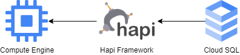
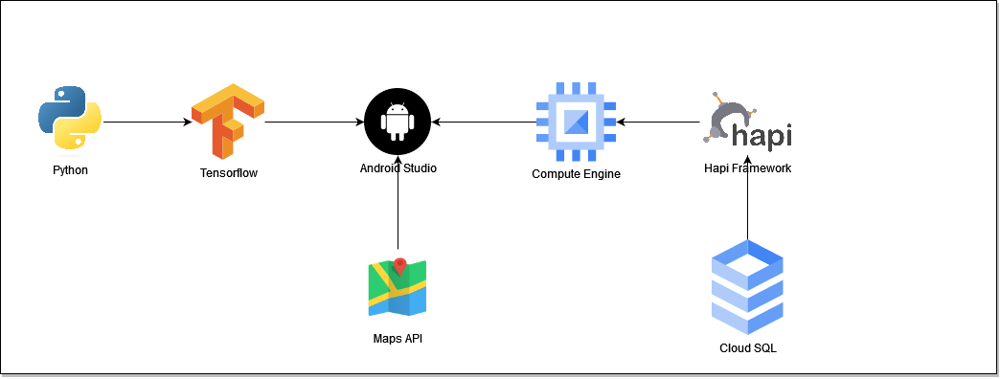

# Defodrym-DatabaseAPI

This api repository was created by our team. We created this repository to connect the database from mysql to the API backend using the Hapi framework which will later be deployed to the cloud platform. The url from the compute engine will later be handed over to Android Studio which is handled by the mobile development team.

## Our Cloud Computing Team:
* Ubaedillah Rohman (C168DSX2221)
* Afiq Mustofa (C252DSX1625)

## Cloud Architecture
<p align="center">
  
</p>
<br/>
The section above explains how we created the database and deployed it to the compute engine using the Google Cloud platform. In this case, we not only built the database backend but also created api maps to be given to mobile development in the form of an api key.
<p align="center">
  
</p>
in the picture above this is the architecture that forms a defodrym application, this application is a combination of machine learning and cloud computing so that the code built is integrated into android studio. Following are the results of the Backend database API which was successfully executed.
<p align="center">

</p>

## Requirement
The following are the requirements needed to deploy applications to Google Cloud.
* Do a git clone to the desired repository
* Requires sufficient Google Cloud credits.
* We will need compute engine,vpc,sql to deploy the application

# How to set up backend in google cloud
1. Go to the SSH Button in Instance which has been made.
2. Do this
```
sudo apt update && sudo apt upgrade
```
3. Install npm
```
Sudo apt install npm
```
4. Install NVM
```
curl -o- https://raw.githubusercontent.com/nvm-sh/nvm/v0.37.2/install.sh | bash
```
5. Do git clone
```
git clone https://github.com/kacung110/BackendDatabase-API.git
```
6. Access repository
```
Cd BackendDatabase-API
```
7. Install Module Backend
```
npm install
```
8. Run the backend
```
npm run start
```
# How to access API
to access api we need url from compute engine
```
http://34.101.166.42/getfooddetails/<foodname>
```
# How to make web server running forever
So, we can run this api, then how do we make it run even though it's already out of SSH, because we don't want to monitor the monitor 24 hours just to turn on SSH. One way is to install the pm2 module.
```
sudo apt install pm2
```
by using this module we don't need to monitor for 24 hours executing the hapi framework.
```
pm2 start server
```
